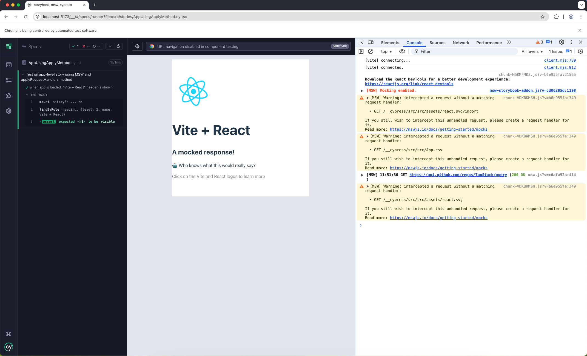
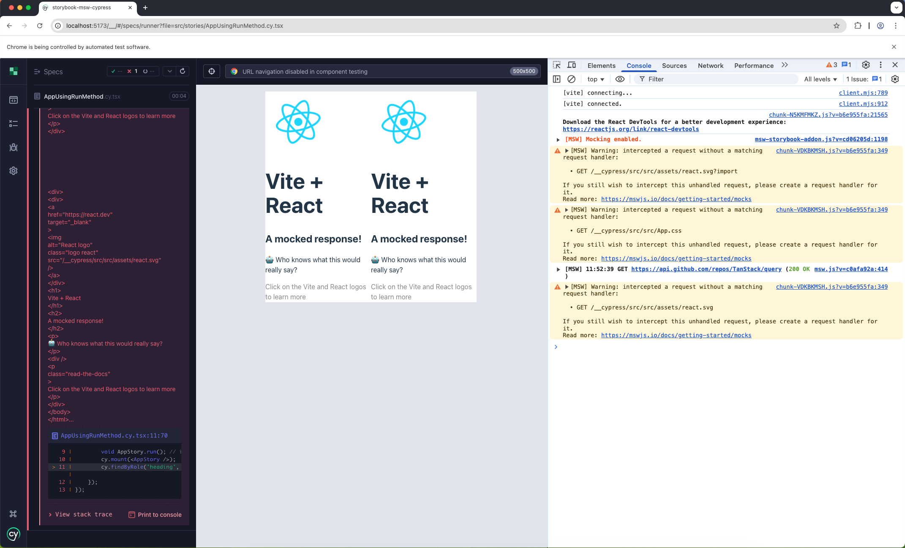

<h1>Repro for Storybook + MSW + Cypress Component Tests</h1>

Related issue: <a href="https://github.com/mswjs/msw-storybook-addon/issues/173">https://github.com/mswjs/msw-storybook-addon/issues/173</a>

<code>main</code> branch of this repo uses Storybook 8 and React 18

<code>with-latest-deps</code> branch of this repo uses later dependencies

<h2>Testing instructions</h2>

Install dependencies:

<pre>
  yarn
</pre>

Run Cypress Component tests:

<pre>
  yarn cy:open
</pre>

See <pre>src/stories/AppUsingApplyMethod.cy.tsx</pre> will pass and DOM shows the app appear once.

See <pre>src/stories/AppUsingRunMethod.cy.tsx</pre> will fail, DOM shows the app appearing twice.

